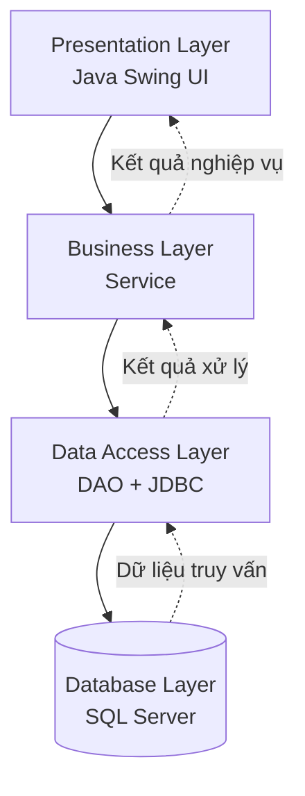

<div align="center">

# 🐾 PetClinic Management System

### Hệ thống quản lý chuỗi phòng khám thú y và chăm sóc vật nuôi

Ứng dụng Desktop được xây dựng bằng **Java Swing**, sử dụng **JDBC** để kết nối cơ sở dữ liệu **Microsoft SQL Server**.

<br>


</div>

---

## 👥 Thành viên nhóm

| STT | Họ và tên | Vai trò |
|:---:|---|---|
| 1 | Quàng Duy Thái | Leader |
| 2 | Trương Hoài Sơn | Member |
| 3 | Trần Long Vũ | Secretary |
| 4 | Lê Nguyễn Nam Anh | Member |

---

---

## 📌 Giới thiệu

**PetClinic Management System** là phần mềm quản lý chuỗi phòng khám thú y, hỗ trợ quản lý tập trung thông tin khách hàng, thú cưng, chi nhánh, nhân viên, dịch vụ, thuốc, lịch hẹn, hồ sơ khám bệnh và hóa đơn thanh toán.

Dự án được phát triển nhằm phục vụ công tác quản lý và vận hành phòng khám thú y, đồng thời áp dụng kiến thức lập trình Java, lập trình giao diện desktop, kết nối cơ sở dữ liệu và thiết kế phần mềm theo mô hình phân tầng.

### 🎯 Mục tiêu

- Số hóa quy trình quản lý phòng khám thú y.
- Quản lý thông tin khách hàng và hồ sơ thú cưng.
- Hỗ trợ quy trình đặt lịch, khám bệnh và thanh toán.
- Theo dõi hoạt động của các chi nhánh.
- Thống kê doanh thu và tình hình hoạt động.
- Xây dựng ứng dụng có cấu trúc rõ ràng, dễ bảo trì và mở rộng.

---

## ✨ Chức năng chính

| Chức năng | Mô tả |
|---|---|
| 👥 Quản lý khách hàng | Thêm, sửa, xóa và tìm kiếm thông tin khách hàng |
| 🐶 Quản lý thú cưng | Quản lý thông tin, chủ nuôi và lịch sử khám bệnh |
| 🏥 Quản lý chi nhánh | Quản lý thông tin và hoạt động của từng chi nhánh |
| 👨‍⚕️ Quản lý nhân viên | Quản lý nhân viên, bác sĩ và tài khoản đăng nhập |
| 💊 Quản lý dịch vụ và thuốc | Quản lý danh mục dịch vụ, thuốc và bảng giá |
| 📅 Quản lý lịch hẹn | Tiếp nhận, theo dõi và phân công lịch khám |
| 🩺 Quản lý khám bệnh | Lưu hồ sơ khám, chẩn đoán và đơn thuốc |
| 🧾 Quản lý hóa đơn | Tính chi phí, quản lý thanh toán và xuất hóa đơn |
| 📊 Thống kê, báo cáo | Tổng hợp doanh thu và số lượt khám |

Các chức năng được nối với cơ sở dữ liệu SQL Server và được hiển thị theo vai trò đăng nhập.

---

## 🛠️ Công nghệ sử dụng

| Công nghệ | Vai trò |
|---|---|
| Java SE 17+ | Ngôn ngữ lập trình |
| Java Swing | Xây dựng giao diện Desktop |
| JDBC | Kết nối và thao tác với cơ sở dữ liệu |
| Microsoft SQL Server | Hệ quản trị cơ sở dữ liệu |
| Microsoft JDBC Driver | Driver kết nối Java với SQL Server |
| NetBeans IDE | Môi trường phát triển |
| FlatLaf | Tùy chọn giao diện hiện đại |
| Maven / Ant | Quản lý thư viện và build dự án |

---

## 🏗️ Kiến trúc hệ thống

Dự án áp dụng mô hình **MVC kết hợp kiến trúc phân tầng**, giúp tách biệt giao diện, xử lý nghiệp vụ và truy xuất dữ liệu.



### Các tầng trong hệ thống

- **Presentation Layer:** Hiển thị giao diện và tiếp nhận thao tác người dùng.
- **Business Layer:** Xử lý nghiệp vụ, kiểm tra dữ liệu và phân quyền.
- **Data Access Layer:** Thực hiện các truy vấn SQL thông qua JDBC.
- **Database Layer:** Lưu trữ dữ liệu và đảm bảo tính toàn vẹn.

---

## 📂 Cấu trúc dự án

```text
PetClinicManagement/
│
├── src/
│   ├── app/
│   │   └── MainApp.java
│   │
│   ├── config/
│   │   ├── DatabaseConnection.java
│   │   └── AppConfig.java
│   │
│   ├── entity/
│   │   ├── Branch.java
│   │   ├── Customer.java
│   │   ├── Pet.java
│   │   ├── Employee.java
│   │   ├── Service.java
│   │   ├── MedicalRecord.java
│   │   ├── MedicalDetail.java
│   │   └── Invoice.java
│   │
│   ├── dao/
│   │   ├── BaseDAO.java
│   │   ├── BranchDAO.java
│   │   ├── CustomerDAO.java
│   │   ├── PetDAO.java
│   │   ├── EmployeeDAO.java
│   │   ├── ServiceDAO.java
│   │   ├── MedicalRecordDAO.java
│   │   └── InvoiceDAO.java
│   │
│   ├── service/
│   │   ├── AuthService.java
│   │   ├── CustomerService.java
│   │   ├── MedicalService.java
│   │   ├── BillingService.java
│   │   └── ReportService.java
│   │
│   ├── ui/
│   │   ├── common/
│   │   ├── auth/
│   │   ├── modules/
│   │   └── components/
│   │
│   └── util/
│       ├── DateUtil.java
│       ├── PasswordUtil.java
│       ├── PDFExporter.java
│       └── ValidationUtil.java
│
├── database/
│   └── schema.sql
│
├── README.md
└── .gitignore
```

---

## ⚙️ Yêu cầu hệ thống

Trước khi chạy ứng dụng, cần chuẩn bị:

- JDK 17 trở lên.
- NetBeans IDE hoặc IDE Java tương đương.
- Microsoft SQL Server.
- Microsoft SQL Server JDBC Driver.
- Cơ sở dữ liệu `PetClinicDB`.

---

## Chức năng đã triển khai

- Đăng nhập, đăng xuất và phân quyền theo `Admin`, `BacSi`, `NhanVien`; mật khẩu mới được băm bằng PBKDF2. Tài khoản mẫu có mật khẩu cũ được nâng cấp sau lần đăng nhập thành công.
- Nhân viên có thể tự đăng ký theo chi nhánh; tài khoản mặc định ở trạng thái chờ duyệt, chỉ đăng nhập được sau khi Admin chuyển trạng thái thành `Active` trong màn hình Nhân viên & tài khoản.
- Dashboard mặc định cho Admin: số chi nhánh, nhân viên, khách hàng, thú cưng, lịch hẹn hôm nay, doanh thu tháng, hóa đơn chưa trả, cảnh báo tồn thấp, lịch hẹn sắp tới và biểu đồ doanh thu 6 tháng.
- Giao diện dùng theme xanh dương thống nhất, icon vector vẽ bằng Java2D, sidebar điều hướng, thẻ chỉ số và biểu đồ trực quan; không cần tải thêm thư viện icon.
- Quản lý chi nhánh, nhân viên/tài khoản, khách hàng, thú cưng, lịch hẹn, phiếu khám, chi tiết kê đơn, thuốc và dịch vụ.
- Theo dõi tiêm phòng, ngày nhắc tiêm/tái khám và tra cứu lịch sử khám toàn chuỗi.
- Nhập/xuất kho theo giao dịch, cập nhật tồn kho và chặn xuất quá số lượng hiện có.
- Lập hóa đơn từ chi tiết phiếu khám, xác nhận thanh toán, in hóa đơn và báo cáo doanh thu theo chi nhánh.
- Xuất danh sách, lịch sử, hóa đơn và báo cáo thành tệp Excel `.xlsx`.

## 🚀 Hướng dẫn cài đặt và chạy

1. Mở `schema.sql` bằng SQL Server Management Studio và thực thi để tạo `PetClinicDB`, dữ liệu cơ bản và các bảng.
2. Nếu database đã tồn tại từ phiên bản trước, chạy `account_approval.sql` để thêm trạng thái duyệt tài khoản; với database mới, bước này không cần thiết.
3. Chạy `photo_columns.sql` một lần để bổ sung cột ảnh nếu database đã được tạo từ trước. Với database mới, file này vẫn an toàn để chạy.
4. Thực thi `sample_data.sql` để thêm khách hàng, thú cưng, lịch hẹn, hồ sơ khám, hóa đơn, tiêm chủng và giao dịch kho mẫu. Script có thể chạy lại mà không thêm trùng dữ liệu mẫu.
5. Tạo `db.properties` từ `db.properties.example` trong thư mục dự án; nhập `db.url`, `db.user` và `db.password` của SQL Server.
6. Chạy `mvn clean compile exec:java` hoặc chạy lớp `com.petclinic.pet.clinic.management.PetClinicManagement` từ NetBeans/IDE.

Trong cửa sổ thêm/cập nhật thú cưng và nhân viên, có thể chọn ảnh JPG, PNG, GIF hoặc BMP (tối đa 5 MB). Ảnh được lưu trong SQL Server và có thể gỡ bỏ khi cập nhật hồ sơ.

Tài khoản đăng nhập mẫu sau khi chạy hai file SQL:

| Vai trò | Tên đăng nhập | Mật khẩu |
|---|---|---|
| Quản trị viên | `admin` | `admin123` |
| Bác sĩ Quận 1 | `bsa` | `123456` |
| Lễ tân | `letan` | `123456` |
| Bác sĩ Cầu Giấy | `bacsi_hn_demo` | `PetClinic123!` |

Đây là tài khoản demo để thử nghiệm; hãy đổi mật khẩu trước khi dùng dữ liệu thật.

Không commit mật khẩu cơ sở dữ liệu thật. File `db.properties` đã được loại trừ khỏi Git.


## 🔒 Bảo mật

- Sử dụng `PreparedStatement` để truyền tham số cho câu lệnh SQL.
- Mật khẩu mới được băm bằng PBKDF2; tài khoản mẫu được chuyển từ mật khẩu cũ sau lần đăng nhập thành công đầu tiên.
- Phân quyền truy cập theo vai trò người dùng.
- Không commit thông tin đăng nhập hoặc thông tin kết nối nhạy cảm.
- Sử dụng `.gitignore` để loại trừ các file cấu hình chứa thông tin bí mật.

---

## 📈 Định hướng phát triển

- Nâng cấp kiểm thử tích hợp với SQL Server.
- Tiếp tục cải thiện giao diện và trải nghiệm người dùng.

---

<div align="center">

**PetClinic Management System**

*Java Swing • JDBC • SQL Server*

Developed by PetClinic Team

</div>