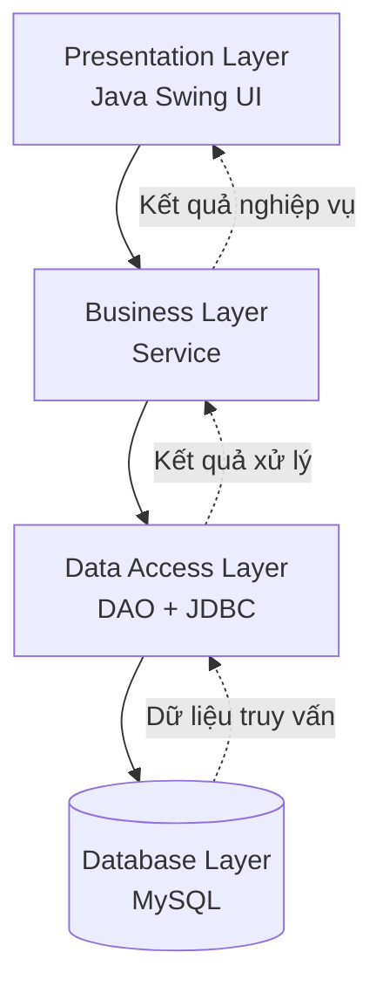

<div align="center">

# 🐾 PetClinic Management System

### Hệ thống quản lý chuỗi phòng khám thú y và chăm sóc vật nuôi

Ứng dụng Desktop được xây dựng bằng **Java Swing**, sử dụng **JDBC** để kết nối cơ sở dữ liệu **MySQL**.

<br>


</div>

---

## 👥 Thành viên nhóm

| STT | Họ và tên | Vai trò |
|:---:|---|---|
| 1 | Quàng Duy Thái | Leader |
| 2 | Trương Hoài Sơn | Member |
| 3 | Trần Long Vũ | Secretary |
| 4 | Lê Nguyễn Nam Anh | Member |

---

---

## 📌 Giới thiệu

**PetClinic Management System** là phần mềm quản lý chuỗi phòng khám thú y, hỗ trợ quản lý tập trung thông tin khách hàng, thú cưng, chi nhánh, nhân viên, dịch vụ, thuốc, lịch hẹn, hồ sơ khám bệnh và hóa đơn thanh toán.

Dự án được phát triển nhằm phục vụ công tác quản lý và vận hành phòng khám thú y, đồng thời áp dụng kiến thức lập trình Java, lập trình giao diện desktop, kết nối cơ sở dữ liệu và thiết kế phần mềm theo mô hình phân tầng.

### 🎯 Mục tiêu

- Số hóa quy trình quản lý phòng khám thú y.
- Quản lý thông tin khách hàng và hồ sơ thú cưng.
- Hỗ trợ quy trình đặt lịch, khám bệnh và thanh toán.
- Theo dõi hoạt động của các chi nhánh.
- Thống kê doanh thu và tình hình hoạt động.
- Xây dựng ứng dụng có cấu trúc rõ ràng, dễ bảo trì và mở rộng.

---

## ✨ Chức năng chính

| Chức năng | Mô tả |
|---|---|
| 👥 Quản lý khách hàng | Thêm, sửa, xóa và tìm kiếm thông tin khách hàng |
| 🐶 Quản lý thú cưng | Quản lý thông tin, chủ nuôi và lịch sử khám bệnh |
| 🏥 Quản lý chi nhánh | Quản lý thông tin và hoạt động của từng chi nhánh |
| 👨‍⚕️ Quản lý nhân viên | Quản lý nhân viên, bác sĩ và tài khoản đăng nhập |
| 💊 Quản lý dịch vụ và thuốc | Quản lý danh mục dịch vụ, thuốc và bảng giá |
| 📅 Quản lý lịch hẹn | Tiếp nhận, theo dõi và phân công lịch khám |
| 🩺 Quản lý khám bệnh | Lưu hồ sơ khám, chẩn đoán và đơn thuốc |
| 🧾 Quản lý hóa đơn | Tính chi phí, quản lý thanh toán và xuất hóa đơn |
| 📊 Thống kê, báo cáo | Tổng hợp doanh thu và số lượt khám |

> Lưu ý: Danh sách trên mô tả phạm vi chức năng của dự án. Các chức năng sẽ được cập nhật theo tiến độ triển khai thực tế.

---

## 🛠️ Công nghệ sử dụng

| Công nghệ | Vai trò |
|---|---|
| Java SE 11+ | Ngôn ngữ lập trình |
| Java Swing | Xây dựng giao diện Desktop |
| JDBC | Kết nối và thao tác với cơ sở dữ liệu |
| MySQL | Hệ quản trị cơ sở dữ liệu |
| MySQL Connector/J | Driver kết nối Java với MySQL |
| NetBeans IDE | Môi trường phát triển |
| FlatLaf | Tùy chọn giao diện hiện đại |
| Maven / Ant | Quản lý thư viện và build dự án |

---

## 🏗️ Kiến trúc hệ thống

Dự án áp dụng mô hình **MVC kết hợp kiến trúc phân tầng**, giúp tách biệt giao diện, xử lý nghiệp vụ và truy xuất dữ liệu.



### Các tầng trong hệ thống

- **Presentation Layer:** Hiển thị giao diện và tiếp nhận thao tác người dùng.
- **Business Layer:** Xử lý nghiệp vụ, kiểm tra dữ liệu và phân quyền.
- **Data Access Layer:** Thực hiện các truy vấn SQL thông qua JDBC.
- **Database Layer:** Lưu trữ dữ liệu và đảm bảo tính toàn vẹn.

---

## 📂 Cấu trúc dự án

```text
PetClinicManagement/
│
├── src/
│   ├── app/
│   │   └── MainApp.java
│   │
│   ├── config/
│   │   ├── DatabaseConnection.java
│   │   └── AppConfig.java
│   │
│   ├── entity/
│   │   ├── Branch.java
│   │   ├── Customer.java
│   │   ├── Pet.java
│   │   ├── Employee.java
│   │   ├── Service.java
│   │   ├── MedicalRecord.java
│   │   ├── MedicalDetail.java
│   │   └── Invoice.java
│   │
│   ├── dao/
│   │   ├── BaseDAO.java
│   │   ├── BranchDAO.java
│   │   ├── CustomerDAO.java
│   │   ├── PetDAO.java
│   │   ├── EmployeeDAO.java
│   │   ├── ServiceDAO.java
│   │   ├── MedicalRecordDAO.java
│   │   └── InvoiceDAO.java
│   │
│   ├── service/
│   │   ├── AuthService.java
│   │   ├── CustomerService.java
│   │   ├── MedicalService.java
│   │   ├── BillingService.java
│   │   └── ReportService.java
│   │
│   ├── ui/
│   │   ├── common/
│   │   ├── auth/
│   │   ├── modules/
│   │   └── components/
│   │
│   └── util/
│       ├── DateUtil.java
│       ├── PasswordUtil.java
│       ├── PDFExporter.java
│       └── ValidationUtil.java
│
├── database/
│   └── schema.sql
│
├── README.md
└── .gitignore
```

---

## ⚙️ Yêu cầu hệ thống

Trước khi chạy ứng dụng, cần chuẩn bị:

- JDK 11 trở lên.
- NetBeans IDE hoặc IDE Java tương đương.
- MySQL Server.
- MySQL Connector/J.
- Cơ sở dữ liệu `PetClinicDB`.

---

## 🚀 Hướng dẫn cài đặt

### Bước 1: Clone repository

```bash
git clone https://github.com/thaieaut-engineer/Tri-Tue-Nhan-Tao-AI-.git
```

> Thay URL trên bằng URL repository thực tế của dự án PetClinic nếu đây là repository khác.

### Bước 2: Tạo cơ sở dữ liệu

Mở MySQL Workbench, kết nối tới MySQL Server và thực thi file SQL:

```text
database/schema.sql
```

Sau khi tạo thành công, kiểm tra cơ sở dữ liệu `PetClinicDB` và các bảng liên quan.

### Bước 3: Cấu hình kết nối JDBC

Cập nhật thông tin kết nối trong `DatabaseConnection.java` hoặc file cấu hình tương ứng.

Ví dụ:

```java
String url = "jdbc:mysql://localhost:3306/PetClinicDB";
String username = "YOUR_DB_USERNAME";
String password = "YOUR_DB_PASSWORD";
```

Không đưa mật khẩu cơ sở dữ liệu thật vào repository công khai.

### Bước 4: Cài đặt thư viện

Nếu sử dụng Maven, thêm MySQL Connector/J vào file `pom.xml`.

```xml
<dependency>
    <groupId>com.mysql</groupId>
    <artifactId>mysql-connector-j</artifactId>
    <version>9.4.0</version>
</dependency>
```

Nếu sử dụng Ant, thêm file MySQL Connector/J `.jar` vào Libraries của dự án.

### Bước 5: Chạy ứng dụng

1. Mở dự án bằng NetBeans IDE.
2. Kiểm tra cấu hình JDK.
3. Kiểm tra kết nối tới MySQL Server.
4. Chọn lớp `MainApp.java` làm Main Class.
5. Nhấn **Run Project** để khởi chạy ứng dụng.


## 🔒 Bảo mật

- Sử dụng `PreparedStatement` để truyền tham số cho câu lệnh SQL.
- Mã hóa mật khẩu trước khi lưu vào cơ sở dữ liệu.
- Phân quyền truy cập theo vai trò người dùng.
- Không commit thông tin đăng nhập hoặc thông tin kết nối nhạy cảm.
- Sử dụng `.gitignore` để loại trừ các file cấu hình chứa thông tin bí mật.

---

## 📈 Định hướng phát triển

- Hoàn thiện các chức năng quản lý nghiệp vụ.
- Bổ sung quản lý kho thuốc và vật tư y tế.
- Hoàn thiện chức năng đặt lịch và nhắc lịch khám.
- Nâng cấp hệ thống thống kê, báo cáo.
- Cải thiện giao diện và trải nghiệm người dùng.
- Tối ưu hiệu năng truy vấn và xử lý dữ liệu.

---

<div align="center">

**PetClinic Management System**

*Java Swing • JDBC • MySQL*

Developed by PetClinic Team

</div>